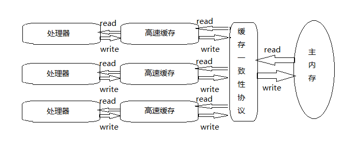
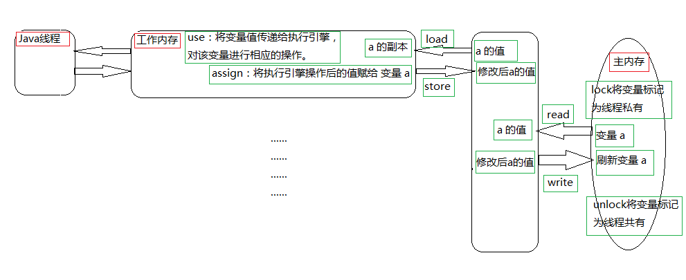

##### 多线程：
    由于计算机的运算速度与它的存储和通信子系统速度的差距太大,  
    处理器大量的时间都是浪费在磁盘I/O、网络通信或者数据库访问上,
    为了压榨计算机的运算能力,于是让计算机同时处理几项任务,进而出现了多线程。

##### 缓存：
    由于计算机的存储速度和处理器的运算速度有几个数量级的差距,
    所以现代计算机都不得不加入一层读写速度尽可能接近处理运算速度的高速缓存来作为内存与处理器之前的缓冲。
##### 工作内存与主存：
    虽然缓存能够很好的解决处理器与内存之间的矛盾,但是由于多线程的缘故也引入了一些新的问题——缓存一致性。
    为了解决这个一致性的问题,于是引入了每个线程的高速缓存和主内存,
    在多处理器系统中,每个处理器都有自己的高度缓存,而它们又共享同一个主内存。
    但是在多个线程都需要操作主内存中的数据时又存在缓存数据不一致的情况,这时又引入了缓存一致性协议。
##### 多线程与高速缓存,缓存一致性协议及其主内存之间的关系如下图：

#### Java内存模型
    大家都知道Java最大的优点是跨平台(一次编译,到处运行),但是由于各个物理机器的硬件和操作系统的内存访问差异,
    所以 JVM 就需要设计一套自己的内存模型来屏蔽掉底层接口的差异。
    JVM 的内存模型和上面我们说的操作系统的内存模型类似,Java中的多个线程均有各自的工作内存,多个线程共享同一个主内存,
    然后缓存一致性的问题通过几个原子操作(Save和Load)来实现。
    Java 内存模型规定了所有的变量(类变量)都存储在主内存中(可与上图的主内存做对比), 
    每个线程均有自己的工作内存(可与上图的高速缓存做对比),线程的工作内存中保存了被该线程使用到的变量的副本拷贝,
    线程对变量的所有操作(读取,赋值等)都必须在工作内存中进行,而不能直接读写主内存中的变量,
    不同的线程之间也无法访问对方工作内存中的变量,线程间变量值的传递均需要通过主内存来完成。
    主内存主要对应于 Java 堆中的对象实例数据部分,而工作内存则对应于虚拟机栈中的部分区域。
    而为了获取更好的运行速度,JVM 可能会让工作内存有限存储于寄存器和告诉缓存中,因为程序运行时主要访问读写的是工作内存。

#### 内存间交互操作
    一个变量如何从主内存拷贝到工作内存,如何从工作内存同步回主内存。
    Java内存模型定义了一下8种操作来完成,虚拟机实现时必须保证每一种操作都是原子的,不可再分的(对double和long类型有例外)。
    1. lock(锁定)：作用于主内存的变量,它把一个变量标识为一条线程独占的状态。
    2. unlock(解锁)：作用于主内存的变量,它把一个处于锁定状态的变量释放出来,释放后的变量可以被其它线程锁定。
    3. read(读取)：作用于主内存的变量,它把一个变量的值从主内存传输到线程的工作内存中,以便随后的 load 动作使用。
    4. load(载入)：作用于工作内存的变量,它把 read 操作从主内存中得到的值放入工作内存的变量副本中。 
    5. use(使用)：作用于工作内存中的变量,它把工作内存中一个变量的值传递给执行引擎,每当虚拟机遇到一个需要使用到变量的值的字节码指令时将执行这个操作。
    6. assign(赋值)：作用于工作内存的变量,它把一个从执行引擎收到的值给工作内存的变量,每当虚拟机遇到一个给变量赋值的字节码指令时执行这个操作。
    7. store(存储)：作用于工作内存中的变量 ,它把工作内存中的一个变量的值传递到主内存中,以便随后的 write 操作使用。
    8. write(写入)：作用于主内存中的变量,它把 store 操作从工作内存中得到的变量的值放入主内存的变量中。
    需要注意的是,lock 和 unlock 操作是从对出现的,当然该操作只能是一个线程操作某个变量,不可多个线程,
    这个线程 lock （锁住）了某个变量,就需要在操作完后 unlock （解锁）对该变量的拥有权,
    可多次 lock ,然后再执行相应次数的 unlock 操作。
##### Java线程内存模型及其相关操作如下图：

##### volatile变量：
    volatile型变量具有可见性,因此对于JVM来说这个变量不会有线程的本地副本,只会放在主存中,所以得到的值一定是最新的。
    普通变量做不到对多线程可见,因为普通变量被一个线程修改后需要回写到主内存中然后其他线程才能访问到被修改后的值。
    但是volatile 变量在高并发下并不是安全的(非原子性的)。
    volatile变量还有一个特点就是可以禁止指令重排序优化,
    普通变量仅仅能够保证在该方法执行过程中所有依赖赋值结果的地方都能获取到正确的结果,
    而不能保证变量赋值操作的顺序和程序代码中的执行顺序一致。

---
#### synchronized、volatile、Atomic区别

| volatile | Atomic |  synchronized  |
|:---------|:-------|:---|
|JVM来说这个变量不会有线程的本地副本 只会放在主存中 所以得到的值一定是最新的,对应++等操作无法保证原子性|   可以保证原子性操作     |  修饰的方法或代码块中变量才会获取到最新的值, 并且修改后会立即同步到主内存  |

#### 扩充
    1. 在Java中除了long和double之外的所有基本类型的读和赋值,都是原子性操作。
       而64位的long 和 double变量由于会被32位的JVM当作两个分离的32位来进行操作,
       所以不具有原子性,会产生字撕裂问题
---
#### 文章内容截取于：
1. <https://blog.csdn.net/qbian/article/details/53612124>
2. <https://blog.csdn.net/qbian/article/details/53736118>